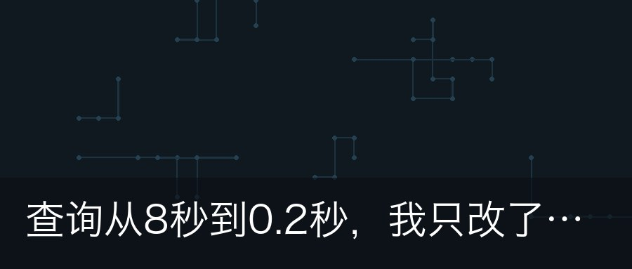

# wechat-mp-autopilot

[](https://github.com/<owner>/wechat-mp-autopilot/actions/workflows/ci.yml)
[](LICENSE)
[](pyproject.toml)

公众号 AI 自动化写作流水线。一条命令（或一个 cron）跑完：

**选题 → 写作 → 去AI味 → 标题优化 → 排版渲染 → 配图 → 推入草稿箱 →（企业认证号）自动发布**

- **双账号形态，同一套代码**：个人公众号跑到草稿箱为止，人工在后台确认发布；企业认证公众号可配置为全自动发布（freepublish）
- **全配置驱动**：账号类型、发布策略、大模型（任意 OpenAI 兼容端点：DeepSeek / GLM / OpenAI / 本地 vLLM……）、账号定位、写作风格，全部收敛在一个 `config.toml`
- **产物落盘 + 断点重跑**：每篇文章独立 `runs/日期-slug/` 目录，每步产物可检视，任一步不满意可 `--from humanize` 从该步重跑
- **去 AI 味双保险**：LLM 重写 + 纯规则检测器（0~100 AI 味指数）；auto 发布模式下指数超标自动降级为只推草稿
- **刻意的克制**：不引入 LangChain/CrewAI（线性管道更透明）、不做 Web UI、不做群发自动化
- **AI 生成的封面与配图**：大模型当美术指导（选图案定配色），本地程序化渲染——零图库依赖、无版权、国内直连

<details>
<summary><b>AI 生成封面效果（点击展开）</b></summary>

| waves · 层叠飘带 | circuit · 电路走线 | mosaic · 几何拼贴 |
|:---:|:---:|:---:|
|  |  |  |

图案与配色由 LLM 按文章标题与账号定位决定，正文小节装饰条与封面同风格同配色。
</details>

```
方向输入 ─▶ ①选题 ─▶ ②写作 ─▶ ③去AI味 ─▶ ④标题 ─▶ ⑤排版 ─▶ ⑥配图 ─▶ ⑦草稿箱
                                                                        │
                                            personal: 到此为止，人工发布 ──┘
                                            enterprise+auto: ⑧提交发布 ─▶ ⑨轮询 ─▶ 文章上线
```

## 两种账号形态

| | `personal` 个人公众号 | `enterprise` 企业认证公众号 |
|---|---|---|
| 流程终点 | 草稿箱（人工后台发布） | 可全自动发布 |
| 发布接口 | 无（2025.7 起个人号被回收权限） | `freepublish/submit` + 轮询 |
| 数据回流 | 人工补录（`autopilot stats`） | 同左（datacube 自动拉取规划中） |
| AI 味超标时 | 标黄，人工审核重点看 | 自动降级为只推草稿 |
| 适用场景 | 有质量/合规安全垫的半自动 | 全自动日更 |

> **「发布」≠「群发」**：本项目自动化的「发布」指文章正式发表（出现在公众号主页、可搜索可分享）；**不会推送到粉丝会话**。群发（订阅号 1 次/天、服务号 4 次/月）不在自动化范围，需要推粉丝请在后台手动操作。

## 快速开始

要求：Python ≥ 3.11、[uv](https://docs.astral.sh/uv/)、一个微信公众号（后台能拿到 AppID/AppSecret）。

```bash
git clone https://github.com/<you>/wechat-mp-autopilot.git
cd wechat-mp-autopilot
uv sync

uv run autopilot init        # 生成 config.toml + .env 并给出填写指引
$EDITOR .env config.toml     # 填密钥与账号定位
uv run autopilot verify      # 自检：配置 + 微信/模型连通性 + 权限探测
uv run autopilot run --direction "你的选题方向"
```

跑完后：个人号去公众号后台草稿箱过目发布；企业号（`mode="auto"`）等待自动发布完成，`runs/<日期-slug>/` 里能看到文章链接。

别忘了：**公众号后台「设置与开发 → 基本配置 → IP 白名单」加入运行机出口 IP**，否则 token 获取报 40164。

### 日常命令

```bash
uv run autopilot init                                  # 生成 config.toml + .env 并给出填写指引
uv run autopilot skills                                # 查看各阶段能力来源（skill/内置/补充）
uv run autopilot run --direction "AI 编程工具实测"      # 全流程
uv run autopilot run --resume runs/2026-10-01-xxx --from humanize   # 从某步重跑
uv run autopilot run --topic-only --direction "..."    # 只要选题
uv run autopilot verify --with-publish                 # 企业号全链路实测（发测试文后即删）
uv run autopilot status --run runs/xxx                 # 补查自动发布的轮询状态
uv run autopilot unpublish --run runs/xxx              # 回滚误发（freepublish/delete）
uv run autopilot stats --run runs/xxx --day 3          # 人工补录第 3 天阅读数据
```

### 定时写作（两种方式）

**方式一：容器常驻调度（推荐，一条命令搞定）**——项目内置 `schedule` 命令，每日定点自动产出，单日失败不影响后续，无需宿主 cron：

```bash
cp config.example.toml config.toml && $EDITOR config.toml   # 填密钥、定位，[niche].directions 填方向池
docker compose up -d          # 每日 08:00 自动写一篇（compose 里可改时间）
docker compose logs -f        # 看执行日志
```

选题方向从 `niche.directions` 方向池**按日轮换**（今天"两性沟通"、明天"婚姻经营"），也可裸机运行：`uv run autopilot schedule --daily 08:00`。

**方式二：宿主 cron（裸机部署）**：

```bash
# crontab -e ：每天 08:00 跑一篇
0 8 * * * cd /opt/wechat-mp-autopilot && uv run autopilot run --direction "你的方向" >> logs/cron.log 2>&1
```

### 镜像发布与一键部署

仓库配置了 tag 发布流水线（`.github/workflows/docker.yml`）：

```bash
git tag v0.1.0 && git push origin v0.1.0
# → 自动构建 linux/amd64 + linux/arm64 镜像推到 ghcr.io，并创建 GitHub Release
```

别人在服务器上一分钟部署（不需要 clone 仓库）：

```bash
mkdir autopilot && cd autopilot
curl -fsSL -o docker-compose.yml https://raw.githubusercontent.com/<owner>/wechat-mp-autopilot/main/docker-compose.yml
cp /path/to/config.toml . && cp /path/to/.env .      # 或手写：参照仓库 config.example.toml
docker compose up -d
```

镜像 tag 规则：`v0.1.0` → `:0.1.0`、`:0.1`、`:latest`。ghcr.io 国内拉取慢时可配置 Docker 镜像加速，或 fork 后把 workflow 的 registry 换成阿里云 ACR 等国内源。

## 配置一览（config.toml）

完整模板见 [`config.example.toml`](config.example.toml)，关键项：

| 配置 | 说明 |
|---|---|
| `[account].type` | `personal` / `enterprise`，决定流程终点 |
| `[publish].mode` | `draft`（默认）/ `auto`；联锁：`auto` 仅 enterprise 可用，配错启动即报错 |
| `[publish].max_per_day` | 自动发布自我频控上限 |
| `[publish].ai_disclosure` | 摘要与文末自动加「AI 辅助创作」标识（默认开） |
| `[llm]` | base_url / model / temperature / api_key_env，任意 OpenAI 兼容端点 |
| `[llm.writer]` 等环节覆盖 | 可单独给写作环节换更强的模型 |
| `[niche]` | 账号定位（领域/读者/人设/方向池）——选题质量的上限由它决定 |
| `[style].preset` | 写作风格：`wenyi` 文艺 / `ganhuo` 干货 / `youmo` 幽默 |
| `[style].template` | 排版模板：`clean` / `wenyi` |
| `[images].provider` | 配图来源：`gen`（默认，AI 美术指导 + 本地程序化渲染，零图库依赖）/ `local`（固定渐变封面）/ `openverse`（免 key 图库）/ `pixabay`（免费 key）/ `pexels`（已停发新 key，仅老用户） |

敏感信息支持双通道（都配时环境变量优先）：直接填进 `config.toml`（单文件即可跑通），或走 `.env` / 环境变量（适配 Docker `env_file`、systemd、CI secrets 注入，且避免误提交）。

## 用 Skill 定制各阶段能力

各阶段（选题/写作/去AI味/标题/摘要/封面）的专业指令由 **skill** 提供：下载
Agent Skills 格式的技能包（`SKILL.md`），按目录名放入 `skills/` 即生效，无需
改代码。加载优先级：

```
skills/<阶段>/SKILL.md   ← 下载的技能，完全替换内置指令（写作支持 skills/writer.<风格>/ 精确匹配）
prompts/<对应文件>        ← 仓库内置兜底默认（保证 clone 即能跑）
prompts/user/<对应文件>   ← 你的补充说明，始终附加（范文 few-shot、项目特有约束）
```

- `uv run autopilot skills` 查看各阶段当前实际来源
- 每篇 run 记录各阶段来源标签（如 `skill:writer@1.2`），效果可归因
- 写作类 skill 里放自己的代表作做 few-shot——示例比形容词管用
- 注意输出格式契约：topics / titlist / cover 要求 JSON 字段与内置一致，详见 [skills/README.md](skills/README.md)

## 兼容性矩阵

实测状态随社区反馈更新（欢迎提交 [实测报告](.github/ISSUE_TEMPLATE/live_test_report.md)）：

| 路径 | 状态 |
|---|---|
| 个人号：token / 素材 / 草稿推入 | 代码就绪，待作者实测（M0） |
| 企业认证号：草稿推入 | 代码就绪，待社区实测 |
| 企业认证号：freepublish 全自动发布 | 按官方文档实现 + fixture 单测，**待社区实测** |

`autopilot verify` 会在**你的账号上**实际探测权限——那才是权威，矩阵只是参考。

## 合规须知（务必阅读）

- **AI 内容标识**：《人工智能生成合成内容标识办法》（2025.9 施行）要求标识 AI 生成内容。人工发布时请在后台勾选「AI 生成」声明；`auto` 模式下 API 无法勾选该声明，本项目默认在摘要与文末自动加「AI 辅助创作」文字标识（`ai_disclosure`），请勿关闭后隐瞒 AI 属性
- **内容责任**：自动发布没有人工闸门，发布内容的责任在你。建议保持 `max_per_day ≤ 1`，先以 `draft` 模式观察产出质量再开 `auto`
- **图片版权**：远程图库仅用可商用免署名的来源——openverse（限定 CC0/公有领域检索）或自有 key 的 pixabay / pexels；默认 `local` 本地生成无版权问题；不爬搜索引擎图片。注意海外图库在国内服务器通常需要代理，取图失败会自动降级为本地封面
- **平台规则**：纯 AI 批量低质产出可能被平台判定营销号/限流，AI 味超标自动降级只是底线，不是免死金牌

## 开发

```bash
make install      # 安装依赖（含 dev 工具；或 uv sync）
make test         # 全量测试（fixture 驱动，不发真实请求）
make lint         # ruff 检查 + 格式检查
make fmt          # 自动修复 + 格式化
make audit        # 依赖漏洞扫描（pip-audit；CI 中自动跑）
make ci           # 本地模拟 CI（lint + test + audit）
make precommit    # 安装 git hooks：提交前 lint，推送前跑全量测试
```

CI（GitHub Actions）：push/PR 自动跑 lint、Python 3.11/3.12/3.13 矩阵测试、pip-audit 依赖漏洞扫描，见 [ci.yml](.github/workflows/ci.yml)。

架构与决策记录见 [docs/plan.md](docs/plan.md)。

**国内网络提示**：`pyproject.toml` 已默认配置清华 PyPI 镜像（`[[tool.uv.index]]`，海外贡献者可删除）；pre-commit 首次安装需克隆 GitHub hook 仓库，可能需要代理；`make audit` 依赖 PyPI/OSV 在线查询，也可只在 CI 里跑。运行时依赖（微信 API、DeepSeek、生图封面）均国内直连可用。

## License

[MIT](LICENSE)
